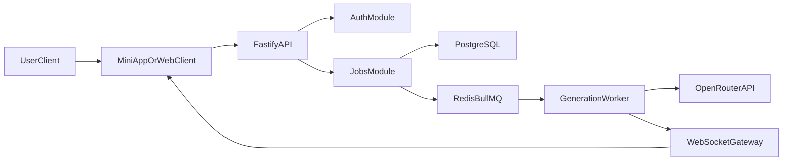
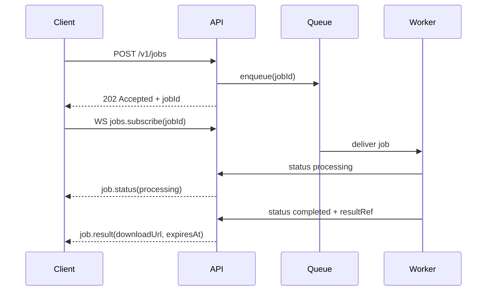

# TG-first, Multi-platform-ready Architecture

## 1) Document Goal

This document defines a production-oriented architecture for an AI photoset assistant with these hard constraints:

- TG Mini App first, but ready for standalone web from day one.
- Frontend stack: React + Vite + TypeScript + Zod + TanStack Query + Zustand + Tailwind + shadcn/ui.
- Backend stack: pure Fastify (without Nest), PostgreSQL, Redis, BullMQ.
- Image privacy mode: no persistent storage of user source/result images.
- Generation provider: OpenRouter API.
- Deployment baseline: classic Docker setup for any VPS.

## 2) Scope and Non-goals

### In scope

- User uploads source image, chooses model and background parameters, receives generated image.
- Auth: Telegram `initData` and web auth in v1.
- Async generation pipeline with retries and realtime job status via WebSocket.
- Audit and observability suitable for production support.

### Out of scope

- Self-hosted ML models and GPU orchestration.
- Long-term media gallery storage.
- Complex event sourcing or microservice split on day one.

## 3) Architecture Principles

- **Platform isolation:** no direct `window.Telegram.WebApp` calls in feature/UI modules.
- **Provider isolation:** OpenRouter calls live behind an AI provider adapter.
- **Async first:** generation never blocks synchronous HTTP request lifecycle.
- **Privacy by default:** source/result images are ephemeral only.
- **Idempotency:** all job create/update flows are safe on retries.
- **Scale by split:** API and worker are independent deploy units.

## 4) High-level Topology



## 5) Technology Stack Matrix

| Layer | Choice | Why |
|---|---|---|
| Frontend app | React + Vite + TypeScript | Fast DX, predictable build, standard ecosystem |
| Runtime DTO validation | Zod | Shared schema between API client/server, safe parsing |
| Data fetching | TanStack Query | Cache, retries, stale control, mutation lifecycle |
| Client state | Zustand | Lightweight state for auth/session/ui capabilities |
| UI styling | Tailwind + shadcn/ui | Fast composition with consistent design tokens |
| Backend server | Fastify + TypeScript | High performance, low abstraction overhead |
| Queue | BullMQ + Redis | Retries, delayed jobs, backoff, worker decoupling |
| DB | PostgreSQL | Reliable transactional storage for users/jobs/audit |
| Realtime | WebSocket (Fastify WS) | Low latency status updates for long-running jobs |
| AI provider | OpenRouter | Centralized API routing to model providers |
| Infra | Docker Compose + Caddy/Nginx | Portable deployment on generic VPS |
| Observability | Pino logs + metrics + Sentry | Supportability with low ops complexity |

## 6) Frontend Architecture (TG-first, Multi-platform-ready)

### 6.1 Layering

- `app/core`: domain logic, use cases, API client, DTO schemas.
- `app/platform`: environment adapters (`telegram`, `web`).
- `app/features`: UI features built only on `core` interfaces.
- `app/shared`: design system primitives and utilities.

### 6.2 Platform Adapter Contract

Define a single platform interface and provide concrete adapters:

```ts
export type PlatformKind = 'telegram' | 'web';

export interface PlatformSDK {
  kind: PlatformKind;
  getUserContext(): Promise<{ platformUserId: string; displayName?: string }>;
  getAuthPayload(): Promise<{ provider: 'telegram' | 'web'; token: string }>;
  getTheme(): 'light' | 'dark';
  onThemeChange?(handler: (theme: 'light' | 'dark') => void): () => void;
  showAlert(message: string): void;
  supports: {
    haptics: boolean;
    mainButton: boolean;
    backButton: boolean;
  };
}
```

Rule: feature components cannot import `window.Telegram.*` directly.

### 6.3 Suggested Frontend Structure

```text
apps/miniapp-web/src/
  app/
    core/
      api/
      dto/
      domain/
      state/
    platform/
      index.ts
      telegram/
      web/
    features/
      auth/
      generation/
      job-status/
    shared/
      ui/
      lib/
```

### 6.4 State and Data Flow

- TanStack Query: server state (`session`, `jobs`, `jobStatus`).
- Zustand: platform capabilities, transient UI state, ws connection state.
- Zod: parse/validate all API payloads at boundary.

## 7) Backend Architecture (Pure Fastify)

### 7.1 Module Boundaries

- `auth`: Telegram `initData` verify + web auth strategy + session issue.
- `users`: profile and limits.
- `jobs`: create/read/cancel generation jobs.
- `generation`: provider prompt assembly, OpenRouter adapter calls.
- `ws`: realtime status events and connection auth.
- `billing` (optional v1.1): credits/quota events.
- `platform`: platform metadata normalization.

### 7.2 Suggested Backend Structure

```text
apps/api/src/
  server.ts
  plugins/
    env.ts
    db.ts
    redis.ts
    auth.ts
    ws.ts
  modules/
    auth/
    users/
    jobs/
    generation/
    platform/
  lib/
    errors/
    logger/
    zod/
apps/worker/src/
  worker.ts
  processors/
    generation.processor.ts
  services/
    openrouter.client.ts
```

### 7.3 API Contract (v1)

#### REST

- `POST /v1/auth/telegram` -> verify `initData`, returns session token.
- `POST /v1/auth/web` -> web login flow, returns session token.
- `POST /v1/jobs` -> create generation job, returns `jobId`.
- `GET /v1/jobs/:jobId` -> job status snapshot.
- `POST /v1/jobs/:jobId/cancel` -> cooperative cancel.

#### WebSocket events

- Client -> server:
  - `jobs.subscribe` `{ jobId }`
  - `jobs.unsubscribe` `{ jobId }`
- Server -> client:
  - `job.status` `{ jobId, status, progress?, errorCode?, completedAt? }`
  - `job.result` `{ jobId, downloadUrl, expiresAt }`

### 7.4 Queue Semantics (BullMQ)

- Queue: `generation_jobs`.
- Job payload: user id, request id, model, background config, secure temp references.
- Retry policy:
  - max attempts: `3`
  - backoff: exponential, base `5s`
  - timeout: provider-specific ceiling (for example `90s`)
- Dead letter handling:
  - mark job `failed`
  - emit websocket failure event
  - persist failure category for analytics

## 8) Data Model (PostgreSQL)

No persistent media blobs. Store metadata and audit trails only.

### 8.1 Core tables

- `users`
  - `id`, `platform_primary`, `created_at`, `status`
- `user_identities`
  - `user_id`, `provider` (`telegram`/`web`), `provider_user_id`, `verified_at`
- `generation_jobs`
  - `id`, `user_id`, `status`, `model`, `background_preset`, `created_at`, `started_at`, `finished_at`, `error_code`
- `generation_requests`
  - `job_id`, `provider` (`openrouter`), `provider_request_id`, `latency_ms`, `token_in`, `token_out`, `cost_estimate`
- `audit_events`
  - `id`, `user_id`, `event_type`, `payload_json`, `created_at`

### 8.2 Indexing baseline

- `generation_jobs(user_id, created_at desc)`
- `generation_jobs(status, created_at)`
- `generation_requests(provider_request_id)`
- `user_identities(provider, provider_user_id)` unique

## 9) Privacy and Security Model (No-persist-at-all)

### 9.1 Media handling policy

- Source and generated images are not stored in persistent object storage.
- Processing uses ephemeral transport only:
  - in-memory buffer and/or encrypted temp file in container tmpfs
  - immediate secure delete after provider response is streamed/returned
- Optional short-lived download links are memory-backed and expire quickly.

### 9.2 Data that can be stored

- Technical metadata (job status, model, latency, error code, token usage).
- No raw image bytes in DB, logs, or analytics.

### 9.3 Required controls

- Redaction: logs must strip binary payloads and PII fragments.
- Secrets: OpenRouter/API tokens only via env/secret manager.
- TLS: mandatory in transit from client to reverse proxy.
- Auth:
  - Telegram: strict server-side signature check for `initData`.
  - Web: signed session/JWT with rotation and expiry.
- Rate limit: per user and per IP, with stricter job-create window.

## 10) Realtime Model (WebSocket)



### 10.1 Reliability behavior

- Client reconnect strategy with jittered backoff.
- On reconnect, client calls `GET /v1/jobs/:jobId` to reconcile state.
- Server sends monotonic status version per job to avoid out-of-order UI updates.

## 11) Docker-first VPS Deployment

### 11.1 Services in Compose

- `reverse-proxy` (Caddy or Nginx with TLS termination)
- `frontend` (Vite build served as static assets)
- `api` (Fastify app)
- `worker` (BullMQ consumer)
- `postgres`
- `redis`

No S3 service is needed under strict no-persist policy.

### 11.2 Deployment flow

1. Build immutable images for `frontend`, `api`, `worker`.
2. Pull images on VPS.
3. `docker compose up -d`.
4. Run DB migrations before traffic switch.
5. Health-check gate before enabling production route.

### 11.3 Environment baseline

- `NODE_ENV=production`
- `DATABASE_URL`
- `REDIS_URL`
- `OPENROUTER_API_KEY`
- `JWT_SECRET` (or keypair path)
- `TELEGRAM_BOT_TOKEN` (for initData verification workflow)
- `WS_ALLOWED_ORIGINS`
- `RATE_LIMIT_CONFIG`

### 11.4 Backups and restore

- Backup only PostgreSQL (metadata/audit/configuration).
- Redis persistence is optional (queue can be rebuilt from DB pending jobs policy).

## 12) Observability and Operations

### 12.1 Logging

- Structured JSON logs (`pino`).
- Correlation IDs:
  - `requestId` for API calls
  - `jobId` for generation lifecycle
  - `providerRequestId` for OpenRouter calls

### 12.2 Metrics

- API p95/p99 latency.
- Job queue depth and wait time.
- Job success/failure rate by model.
- OpenRouter error rate and timeout ratio.
- Active WebSocket connections.

### 12.3 Alerting minimum set

- Queue depth over threshold for N minutes.
- Job failure ratio above baseline.
- Provider timeout spike.
- WS connection error spike.

## 13) Scaling Strategy

### MVP

- Single VPS, one instance per service.
- Vertical scaling first (CPU/RAM).

### Next

- Scale workers horizontally by queue pressure.
- Keep API stateless and replicate under reverse proxy.
- Split Redis/Postgres to managed services when needed.

### Advanced

- Multi-provider routing logic (fallback model/provider by policy).
- Regional edge fronting for lower websocket latency.

## 14) Risk Register and Mitigations

| Risk | Impact | Mitigation |
|---|---|---|
| OpenRouter outage or high latency | Jobs fail or exceed SLA | Retry with capped backoff, provider fallback policy |
| WebSocket disconnect storms | Delayed UX updates | Reconnect + REST reconciliation endpoint |
| Privacy leakage in logs | Compliance breach | Strict redaction middleware + payload denylist |
| Retry duplicates | Double billing/incorrect state | Idempotency keys + unique constraints + status versioning |
| Queue overload | Rising wait time | Autoscale worker replicas + admission control |

## 15) Implementation Roadmap

### Phase 1: Foundation

- Monorepo setup (`miniapp-web`, `api`, `worker`).
- Shared types/schemas package.
- Basic auth (telegram + web) and session flow.

### Phase 2: Generation pipeline

- Job create/read endpoints.
- BullMQ worker and OpenRouter integration adapter.
- WebSocket subscribe/push status flow.

### Phase 3: Hardening

- Rate limits, idempotency, retries/dead-letter.
- Security headers, CORS policy, request validation.
- Observability dashboard + alert rules.

### Phase 4: Scale and productization

- Worker autoscaling policy.
- Billing/quota module.
- Multi-provider fallback strategy.

## 16) Production Readiness Checklist

- [ ] DTO validation on every external boundary (request/response/event).
- [ ] No direct Telegram global usage outside platform adapter.
- [ ] No persistent image storage, verified by code and log audit.
- [ ] Idempotency on job creation and provider callback paths.
- [ ] WebSocket auth + reconnect + state reconciliation.
- [ ] DB migration and rollback procedure documented.
- [ ] SLOs and alert thresholds configured.
- [ ] Secrets rotation procedure documented.
- [ ] Load test executed on queue + websocket paths.

## 17) Final Decision Summary

The chosen stack (React/Vite/TS + pure Fastify + PostgreSQL + Redis/BullMQ + WebSocket) is a balanced standard for:

- fast delivery by a frontend-led team,
- clear scaling path without premature complexity,
- strict privacy operation with no persistent media storage,
- TG-first product launch without locking the codebase to Telegram-only runtime.
