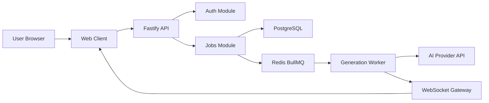
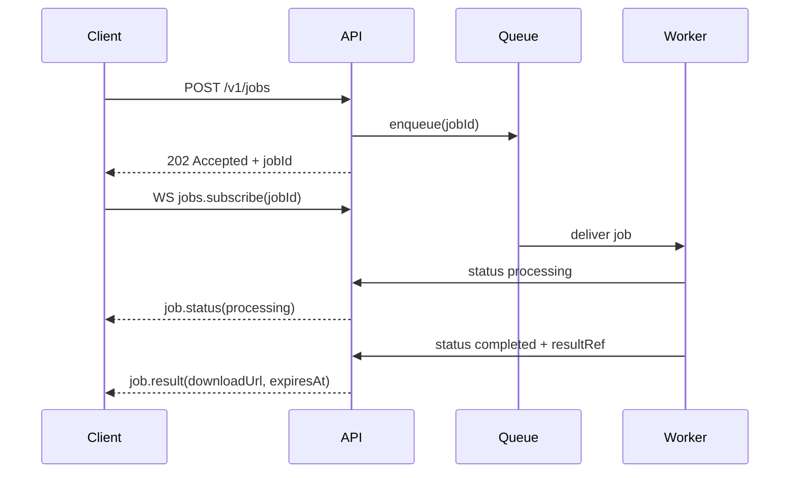

# Web-first Architecture

## 1) Цель документа

Документ описывает целевую архитектуру AI photoset assistant в формате **web-only** приложения.

Базовые ограничения:

- только standalone web-клиент;
- frontend: React + Vite + TypeScript + Zod + TanStack Query + Zustand;
- backend: Fastify + PostgreSQL + Redis + BullMQ;
- изображения пользователей и результаты генерации не должны храниться как постоянные медиа-объекты;
- деплой должен оставаться простым и переносимым на обычный VPS через Docker.

## 2) Scope и non-goals

### In scope

- пользователь загружает исходное изображение;
- выбирает модель и параметры генерации;
- запускает генерацию и получает результат;
- отслеживает статус job через REST и WebSocket;
- система поддерживает очередь, повторы и базовую наблюдаемость.

### Out of scope

- нативные мобильные клиенты;
- дополнительные платформенные клиенты вне браузера;
- self-hosted ML-инференс и GPU orchestration;
- долгосрочное хранение исходных и сгенерированных изображений.

## 3) Архитектурные принципы

- **Web-only:** продукт строится только вокруг веб-клиента без дополнительных платформенных адаптеров.
- **Async first:** генерация не блокирует жизненный цикл HTTP-запроса.
- **Provider isolation:** интеграция с AI-провайдером живет за отдельным adapter/service слоем.
- **Privacy by default:** сохраняются только метаданные, а не бинарные медиа.
- **Idempotency:** создание и обработка job должны быть безопасны при повторных запросах.
- **Split by runtime:** API и worker являются отдельными deploy units.

## 4) Высокоуровневая схема



## 5) Матрица технологий

| Layer | Choice | Why |
|---|---|---|
| Frontend app | React + Vite + TypeScript | Быстрая разработка, стандартный стек, хороший DX |
| Runtime validation | Zod | Единая валидация DTO на границах |
| Data fetching | TanStack Query | Управление cache, retry и mutation lifecycle |
| Client state | Zustand | Легковесный локальный state |
| Backend server | Fastify + TypeScript | Производительность и низкий abstraction overhead |
| Queue | BullMQ + Redis | Асинхронные задачи, retry и decoupling |
| Database | PostgreSQL | Надежное хранение пользователей, job и audit metadata |
| Realtime | WebSocket | Быстрые обновления статуса долгих задач |
| Observability | Pino + metrics + Sentry | Поддержка production-окружения |
| Infra | Docker Compose | Простой переносимый baseline для VPS |

## 6) Frontend architecture

### 6.1 Слои

- `app/core` - доменная логика, DTO, API client, use cases;
- `app/features` - сценарии пользователя и экраны;
- `app/shared` - UI primitives, утилиты и общие хуки;
- `app/lib` - инфраструктурные helper-функции.

### 6.2 Рекомендуемая структура

```text
apps/web/src/
  app/
    core/
      api/
      dto/
      domain/
      state/
    features/
      auth/
      generation/
      job-status/
    shared/
      ui/
      lib/
```

### 6.3 Data flow

- TanStack Query хранит server state: `session`, `jobs`, `jobStatus`;
- Zustand хранит UI state, временные формы и состояние websocket-подключения;
- Zod валидирует все ответы API на boundary-уровне.

## 7) Backend architecture

### 7.1 Границы модулей

- `auth` - web auth strategy, issue/refresh session;
- `users` - профиль и ограничения;
- `jobs` - создание, чтение и отмена generation jobs;
- `generation` - сборка provider request и orchestration;
- `ws` - realtime status events;
- `billing` - квоты/кредиты, если понадобится на следующем этапе.

### 7.2 Рекомендуемая структура

```text
apps/api/src/
  server.ts
  plugins/
    env.ts
    db.ts
    redis.ts
    auth.ts
    ws.ts
  modules/
    auth/
    users/
    jobs/
    generation/
  lib/
    errors/
    logger/
    zod/
apps/worker/src/
  worker.ts
  processors/
    generation.processor.ts
  services/
    provider.client.ts
```

### 7.3 API contract v1

#### REST

- `POST /v1/auth/login` -> вход пользователя и выдача session token;
- `POST /v1/auth/refresh` -> обновление сессии;
- `POST /v1/jobs` -> создание generation job;
- `GET /v1/jobs/:jobId` -> снимок статуса job;
- `POST /v1/jobs/:jobId/cancel` -> кооперативная отмена задачи.

#### WebSocket events

- client -> server:
  - `jobs.subscribe` `{ jobId }`
  - `jobs.unsubscribe` `{ jobId }`
- server -> client:
  - `job.status` `{ jobId, status, progress?, errorCode?, completedAt? }`
  - `job.result` `{ jobId, downloadUrl, expiresAt }`

### 7.4 Queue semantics

- очередь: `generation_jobs`;
- payload: `userId`, `requestId`, `model`, `backgroundConfig`, `tempMediaRef`;
- retry policy:
  - attempts: `3`
  - backoff: exponential, base `5s`
  - timeout: например `90s`
- dead-letter outcome:
  - пометка job как `failed`
  - websocket event о неуспехе
  - сохранение failure category для аналитики

## 8) Data model

Постоянно хранятся только метаданные и технические события.

### 8.1 Core tables

- `users`
  - `id`, `email`, `created_at`, `status`
- `sessions`
  - `id`, `user_id`, `expires_at`, `created_at`, `revoked_at`
- `generation_jobs`
  - `id`, `user_id`, `status`, `model`, `background_preset`, `created_at`, `started_at`, `finished_at`, `error_code`
- `generation_requests`
  - `job_id`, `provider`, `provider_request_id`, `latency_ms`, `token_in`, `token_out`, `cost_estimate`
- `audit_events`
  - `id`, `user_id`, `event_type`, `payload_json`, `created_at`

### 8.2 Indexing baseline

- `generation_jobs(user_id, created_at desc)`
- `generation_jobs(status, created_at)`
- `generation_requests(provider_request_id)`
- `sessions(user_id, expires_at)`

## 9) Privacy и security

### 9.1 Политика работы с медиа

- исходные и итоговые изображения не сохраняются в постоянное object storage;
- обработка идет через in-memory buffer и/или временные файлы;
- после завершения job временные данные сразу удаляются;
- ссылки на скачивание должны быть короткоживущими.

### 9.2 Что можно хранить

- статус job;
- технические метаданные;
- latency и usage;
- audit events.

Нельзя хранить:

- raw image bytes в БД;
- бинарные payload в логах;
- постоянные ссылки на приватные изображения.

### 9.3 Обязательные меры

- redaction для логов;
- секреты только через env/secret manager;
- TLS на внешнем контуре;
- rate limit по user и IP;
- session/JWT с ротацией и сроками жизни.

## 10) Realtime model



### 10.1 Надежность

- клиент делает reconnect с jittered backoff;
- после reconnect клиент вызывает `GET /v1/jobs/:jobId` для сверки состояния;
- сервер хранит monotonic status version, чтобы не применять устаревшие события.

## 11) Docker-first deployment

### 11.1 Сервисы в compose

- `frontend`
- `api`
- `worker`
- `postgres`
- `redis`
- `reverse-proxy`

### 11.2 Базовый deployment flow

1. Собрать immutable images для `frontend`, `api`, `worker`.
2. Доставить образы на VPS.
3. Выполнить `docker compose up -d`.
4. Применить миграции до открытия трафика.
5. Проверить health-check перед включением production route.

### 11.3 Environment baseline

- `NODE_ENV=production`
- `DATABASE_URL`
- `REDIS_URL`
- `AI_PROVIDER_API_KEY`
- `SESSION_SECRET`
- `WS_ALLOWED_ORIGINS`
- `RATE_LIMIT_CONFIG`

## 12) Observability

### 12.1 Logging

- structured JSON logs через `pino`;
- correlation IDs:
  - `requestId`
  - `jobId`
  - `providerRequestId`

### 12.2 Metrics

- API p95/p99 latency;
- queue depth и wait time;
- job success/failure rate;
- provider timeout rate;
- количество активных WebSocket connections.

### 12.3 Alerting minimum

- queue depth выше порога несколько минут;
- failure ratio выше baseline;
- всплеск provider timeout;
- всплеск websocket errors.

## 13) Scaling strategy

### MVP

- один VPS;
- по одному инстансу каждого сервиса;
- вертикальное масштабирование в первую очередь.

### Next

- горизонтальное масштабирование worker по нагрузке очереди;
- статeless API под reverse proxy;
- вынос Redis/Postgres в managed services при росте нагрузки.

## 14) Risk register

| Risk | Impact | Mitigation |
|---|---|---|
| Provider outage or latency spike | Job не укладываются в SLA | Retry, timeout ceilings, fallback policy |
| WebSocket disconnect storms | Пользователь поздно видит обновления | Reconnect + REST reconciliation |
| Privacy leakage in logs | Security incident | Redaction middleware + denylist |
| Duplicate retries | Неконсистентный state | Idempotency keys + unique constraints |
| Queue overload | Растет время ожидания | Admission control + worker scaling |

## 15) Implementation roadmap

### Phase 1: Foundation

- стабилизировать monorepo (`web`, `api`, `worker`);
- добавить shared DTO/schemas package;
- реализовать базовую web auth и session flow.

### Phase 2: Generation pipeline

- endpoints для job create/read/cancel;
- BullMQ worker и provider adapter;
- WebSocket статус и результат job.

### Phase 3: Hardening

- rate limits, idempotency, retries/dead-letter;
- security headers, CORS policy, request validation;
- observability dashboard и alert rules.

### Phase 4: Productization

- масштабирование worker;
- billing/quota module;
- fallback policy по AI provider.

## 16) Production readiness checklist

- [ ] DTO validation на каждой внешней границе
- [ ] Idempotency для job creation и provider callbacks
- [ ] WebSocket auth, reconnect и state reconciliation
- [ ] No persistent image storage
- [ ] Документированный DB migration/rollback flow
- [ ] Настроенные SLO и alert thresholds
- [ ] Документированная ротация секретов
- [ ] Нагрузочное тестирование очереди и realtime-канала

## 17) Итоговое решение

Выбранная архитектура `React/Vite/TypeScript + Fastify + PostgreSQL + Redis/BullMQ + WebSocket` подходит для:

- быстрого запуска web-продукта;
- постепенного роста без лишней платформенной сложности;
- приватной обработки пользовательских изображений;
- простого VPS-деплоя без избыточной инфраструктуры.
